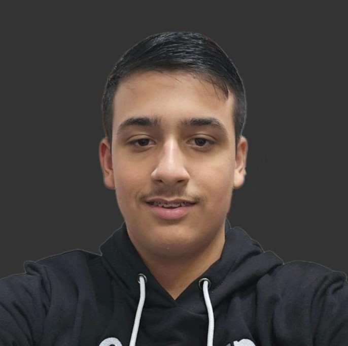

# 2023-2MA-educom-G05
## Laboratório 3D Ciências Natureza

O Projeto visa oferecer uma abordagem inovadora para o ensino de Ciências da Natureza, proporcionando uma experiência de aprendizado envolvente e prática. Através de interações 3D e imersivas, os alunos do ensino médio terão a oportunidade de explorar conceitos de Biologia, Química e Física de maneira interativa e dinâmica.   

Participantes deste projeto:
<table>
  <tr>
    <td align="center">
      <a href="#">
         
        
          <b>Arthur Mello Pimentel</b>
        
      </a>
    </td>
      <td align="center">
      <a href="#">
        
        
          <b>Augusto Rodrigues Feltrin</b>
        
      </a>
    </td>
    <td align="center">
      <a href="#">
        
        
          <b>Christian Augustus Câncio Valini </b>
        
      </a>
    </td>
      <td align="center">
      <a href="#">
          
        
          <b>Lucas Vizeu</b>
        
      </a>
    </td>
  </tr>
</table>

 O Projeto se baseará nas áreas de Química, Biologia e Física, incluindo tópicos como Equações Químicas, Anatomia das Plantas e Leis de Newton. Realizaremos uma visita de campo à Universidade Estácio e documentaremos o progresso no Word para aprimorar o aprendizado e a compreensão nas Ciências da Natureza.